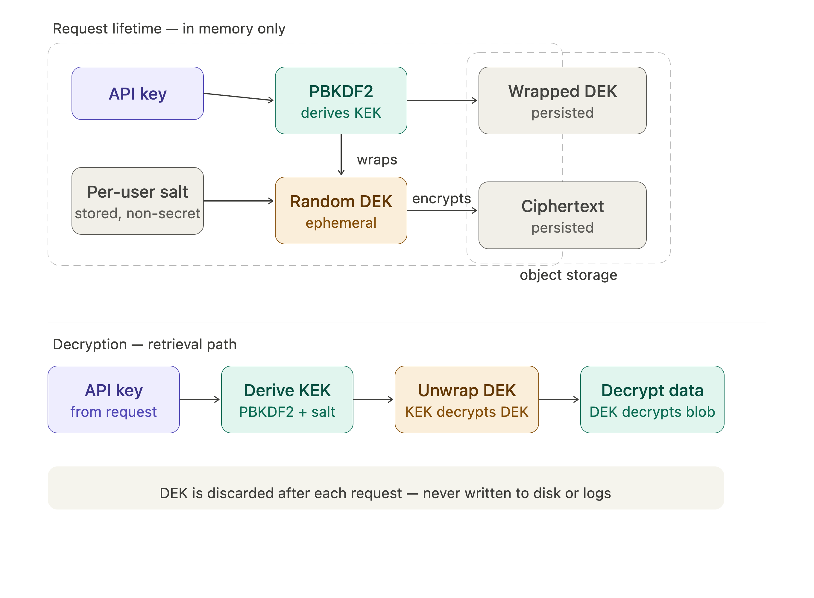

# Anonymous User Storage

**Secure per-user data isolation using API-key-derived envelope encryption**

## The problem

Agentic systems often need to persist user data: conversation history, tool outputs, intermediate results etc. so future interactions can reuse context.

In conventional systems, this is simple: authenticate the user and bind data to a server-side identity.

In anonymous systems, however, there is **no account and no persistent identity**. The only identifier is an API key. This creates a core challenge:

**How can we enforce secure, per-user data isolation without maintaining server-side identity or long-lived secrets?**

## Naive approaches

### Storing unencrypted data

The simplest approach is to store data in plaintext and rely on access controls (e.g. bucket policies, network rules).

This provides **no cryptographic protection**. Any misconfiguration, credential leak, or internal access exposes all user data.

There is also no isolation at the data layer: storage access implies access to everything.

### Server-managed encryption key

Another approach is to encrypt data at rest using a server-managed key (or [KMS](https://en.wikipedia.org/wiki/Key_management#Key_management_system)).

This protects against storage-only compromise, but introduces a new problem: the server must maintain a **mapping from user to key**, effectively recreating a server-side identity system.

More importantly, the server always has access to decryption keys. A compromised application layer can decrypt all user data.

### Using the API key directly as the encryption key

Since the API key is the only user identifier, it may be used directly as an encryption key.

This is flawed:

* **May have insufficient entropy**: API keys are not designed as cryptographic keys. Without a KDF, they are vulnerable to brute-force attacks.
* **No separation of roles**: the same key is used for authentication and encryption.
* **No safe rotation**: rotating the API key makes existing data inaccessible (undecryptable), with no recovery path.

## Solution: [Envelope encryption](https://en.wikipedia.org/wiki/Hybrid_cryptosystem#Envelope_encryption) derived from the API key

### Overview

We derive a per-user encryption key from the API key, and use it to protect a randomly generated data key.

* A unique, per-user **salt** is stored server-side
* At request time, a **Key Encryption Key (KEK)** is derived from the API key using a [Key Derivation Function (KDF)](https://en.wikipedia.org/wiki/Key_derivation_function) (e.g. [PBKDF2](https://en.wikipedia.org/wiki/PBKDF2) or [Argon2](https://en.wikipedia.org/wiki/Argon2))
* A generated random **Data Encryption Key (DEK)** encrypts the data
* The KEK encrypts (wraps) the DEK for storage

Only encrypted data and wrapped keys are persisted.

Data and DEKs are encrypted using [authenticated encryption (AEAD)](https://en.wikipedia.org/wiki/Authenticated_encryption#Authenticated_encryption_with_associated_data), ensuring both confidentiality and integrity.

The server does **not store any long-lived key** capable of decrypting user data. Decryption requires the user’s API key at request time, and all derived keys exist only transiently in memory.

### Compact flow



### Security intuition

* A storage compromise reveals only:

  * salts (non-secret)
  * encrypted DEKs
  * ciphertext

* Decryption requires:

  ```
  API key → KEK → DEK → plaintext
  ```

* Without the API key, an attacker must perform an **offline brute-force attack** against the KDF.

* Using a strong KDF and sufficiently high-entropy API keys makes this computationally infeasible.

### Key rotation

Because the DEK is wrapped separately from the data, rotating an API key does not
require re-encrypting any stored data:

1. Derive the new KEK from the new API key
2. Unwrap each DEK using the old KEK
3. Re-wrap each DEK under the new KEK
4. Persist the new wrapped DEKs

After rotation:
- The new key has full access to all existing encrypted data
- The old key is fully revoked: it cannot unwrap any DEK and therefore
  cannot access any data

### Key properties

* **Per-user isolation**: each user’s data is protected by a key derived from their API key
* **No persistent server secrets**: keys are derived on demand and not stored
* **Defense against storage compromise**: data remains encrypted even if storage is leaked

### Limitations

* **Depends on API key entropy**: weak keys enable brute-force attacks
* **No protection against active server compromise**: keys exist in memory during requests
* **No forward secrecy**: if an API key is exposed, past data can be decrypted
* **Key rotation requires re-wrapping**: existing DEKs must be re-encrypted with the new key
